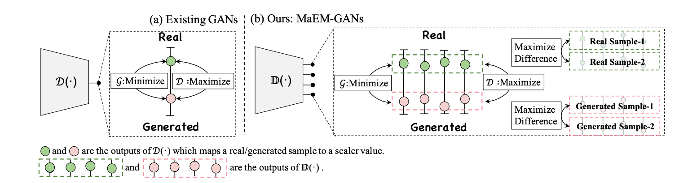

# Combating Mode Collapse via Offline Manifold Entropy Estimation
This is an example code of [Combating Mode Collapse via Offline Manifold Entropy Estimation](https://arxiv.org/pdf/2208.12055.pdf), which is accepted by AAAI'23 (Oral).



[Home Page](https://haozheliu-st.github.io/MEE/)

## Requirements

*   numpy>=1.19.2
*   Pillow>=8.3.1
*   pytorch>=1.2.0
*   torchvision>=0.4.0
*   tqdm>=4.62.3
*   pytorch-fid>=0.3.0

## Datasets
* CIFAR-10 datasets can be downloaded by torchvision. Note that you can set
`torchvision.datasets.CIFAR10(..., download=True)` in `./train.py` to download the corresponding dataset and keep the directory path.

## Usage
* To train MaEM-GAN on CIFAR-10 with GPU, you can define the configuration by
```
CUDA_VISIBLE_DEVICES=${gpu_device} \
python train.py \
    --lr 1e-4 \
    --code_length 64 \
    --model_dir ${your_model_dir} \
    --image_dir ${your_image_dir} \
    --outcomes 16 \
    --epoch 1800 \
    --batch_size 64 \
    --G_split_num 3 \
    --beta1 0.0 \
    --beta2 0.999 \
    --entropy_lr 5e-4 \
    --data_path ${CIFAR_DIR} \
```

Then the model is saved at `[your_model_dir]` and the generated samples can be found at `[your_image_dir]`.

## Manifold Entropy Estimation

If you want to bring Manifold Entropy Estimation to the other cases, please go through below codes. As a plug-and-play module, it can be easily applied to different applications. But this might need to modify the weight of MEE carefully.


* Initialize the replay buffer.

```
def entropy_buffer(buffer_size = args.buffer_size):
    replay_buffer = torch.FloatTensor(buffer_size, args.outcomes).uniform_(-1, 1)
    replay_buffer = torch.stack([replay_buffer.detach() for i in range(args.batch_size)], dim = 1)
    return replay_buffer
```

Note that, in order to compute the entropy efficiency, the replay buffer is intialized as a tensor with (Buffer_Size,N, Embedding_Code_Length).

* Entropy Loss Function

```
def enrtopy_loss(batch_code,replay_buffer):
    batch_code_r = batch_code.unsqueeze(0)# (N,Embedding_Code_Length) -> (1, N,Embedding_Code_Length)
    dist_metric = torch.mean(torch.pow((replay_buffer-batch_code_r),2),dim=2) # pytorch cast
    dist_min,idx = torch.min(dist_metric,dim=0) # Find the adjacent point.
    loss = torch.mean(dist_min) # Maximize this loss 
    batch_code_s = torch.stack([batch_code.detach()],dim=0) 
    replay_buffer = torch.cat((replay_buffer[args.batch_size:],batch_code_s),dim=0) # Update Replay Buffer
    return loss,replay_buffer 
```    

* Traning Strategy

```
    loss_entropy, replay_buffer_real = enrtopy_loss(t_z,replay_buffer_real) # t_z is the output of the discriminator.
    loss_entropy =  -lr * torch.log(loss_entropy)
```


## Test
Test stage consists of two steps, including image generation and FID/I-Variance/Inception-Score calculation.

* Image generation

```
python offline_generate.py \
--image_dir ./off_line_test_samples/ \
--model_path ./model/cifar10/{model name} \
--code_length 64 \
```

{model name} is formed as `...gen.pth`, e.g. `1000gen.pth` (trained 1000 Epochs)

* Test FID
```
python -m pytorch_fid ./off_line_test_samples/label/  ./off_line_test_samples/test/
```

* Test I-Variance Score
```
python inception_variance --image_dir {the generated image dir}
```
Please note that the data reader is based on `ImageFolder`. Hence please remove the real images from the subfolder.
For example,
```
rm -rf ./off_line_test_samples/label/
python inception_variance --image_dir ./off_line_test_samples/
```

* Test Inception Score

Please find tutorial on https://github.com/sbarratt/inception-score-pytorch.

## Large-Scale Case
TBD

## Some Tricks

* The entropy term and DIsoMap can be trained by L2 distance, with rapid convergence but unstable training. To this end, when generalize IAC to large-scale dataset, please replace L2 by cosine similarity.

* In DIsoMap, we use torch.randn to obtain more diverse combinations. If you want to change this into convex combination, please use torch.rand or Beta distribution. Kindly remind that different sample distributions require different hyperparameters. (Thanks for Yan_An Wang' contribution.)

## Bib
If you think this project is useful for your research, please cite as 
```
@article{liu2022combating,
  title={Combating mode collapse in gans via manifold entropy estimation},
  author={Liu, Haozhe and Li, Bing and Wu, Haoqian and Liang, Hanbang and Huang, Yawen and Li, Yuexiang and Ghanem, Bernard and Zheng, Yefeng},
  journal={arXiv preprint arXiv:2208.12055},
  year={2022}
}
```


## Related Github Repo

* Since the proposed method focuses on the learning objectives, we adopt a pure protocol based on simple architecture, i.e. DCGAN. And such protocol can be found at https://github.com/kam1107/RealnessGAN

* The calculation of FID is based on https://github.com/mseitzer/pytorch-fid

* Inception Score and Inception-Variance are based on https://github.com/sbarratt/inception-score-pytorch
